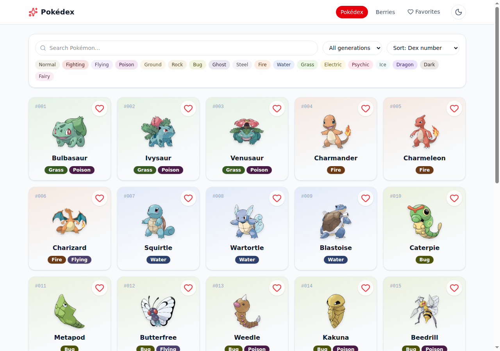
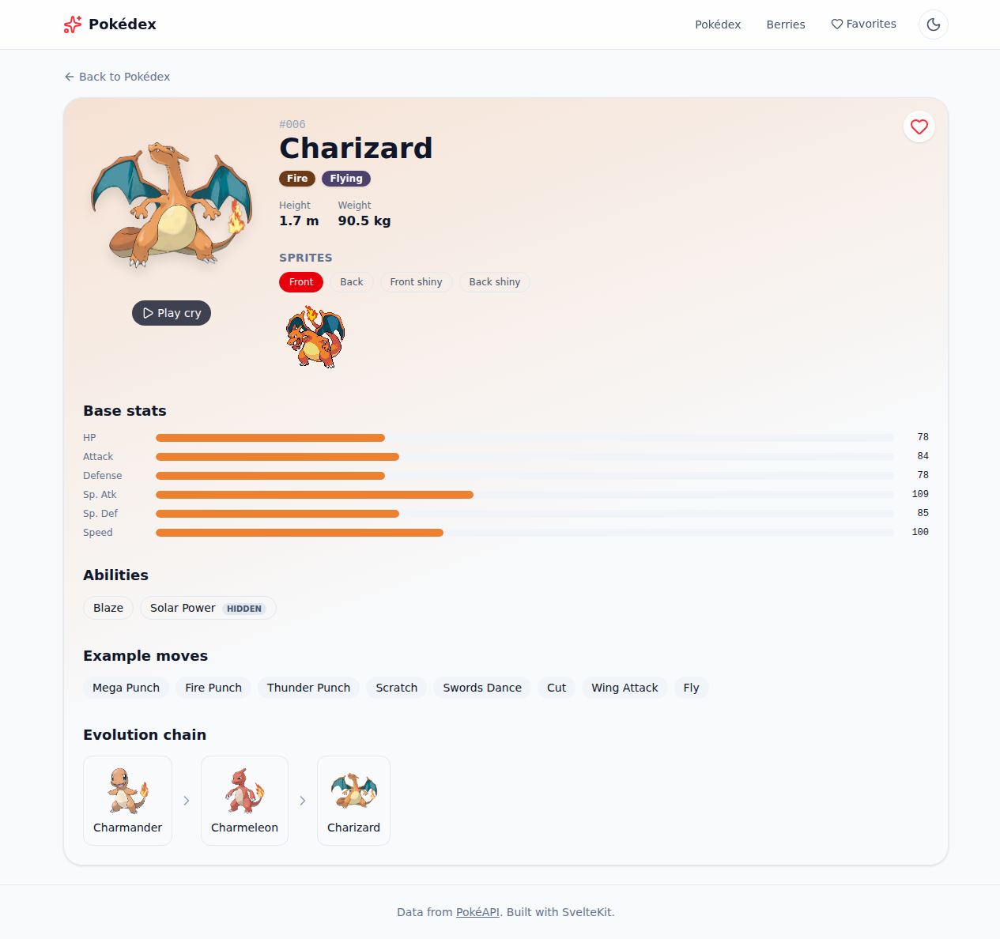
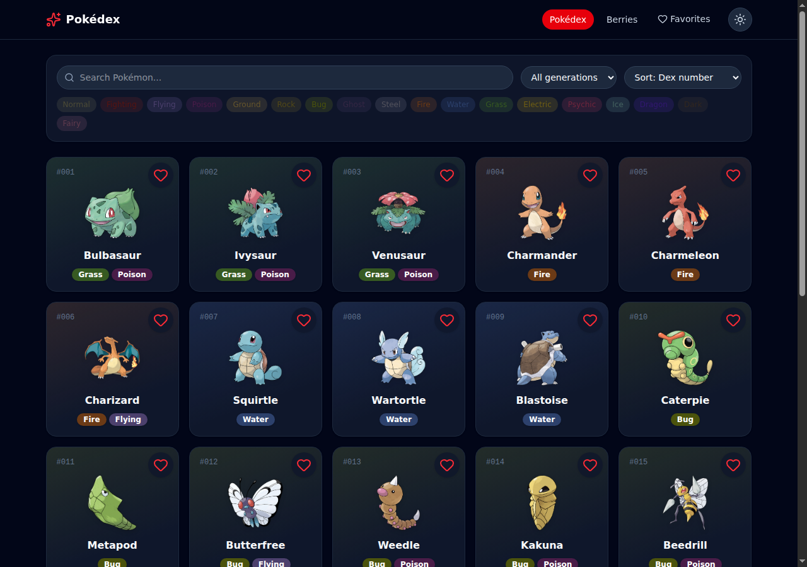
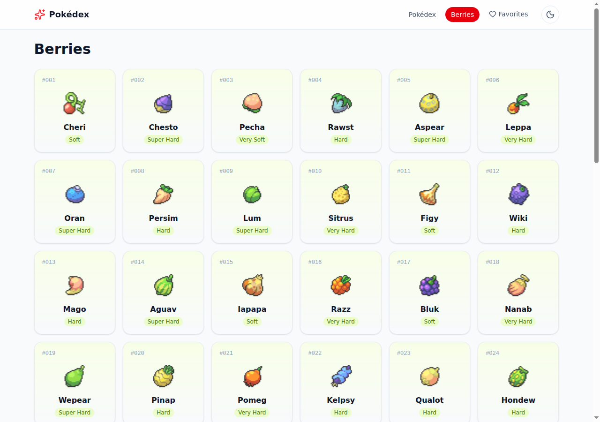
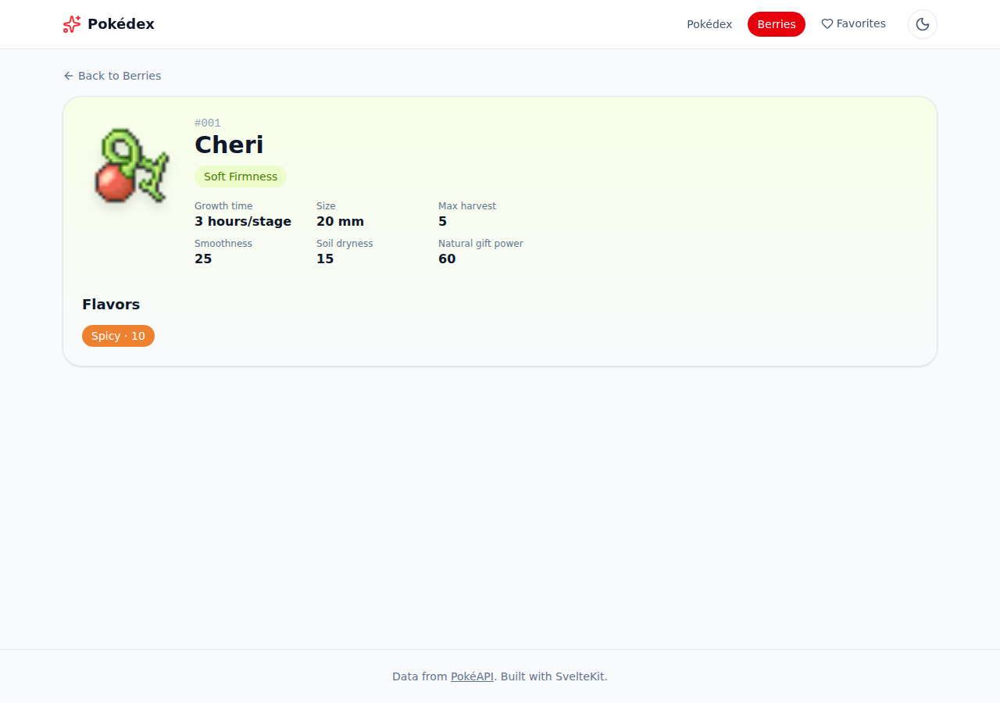
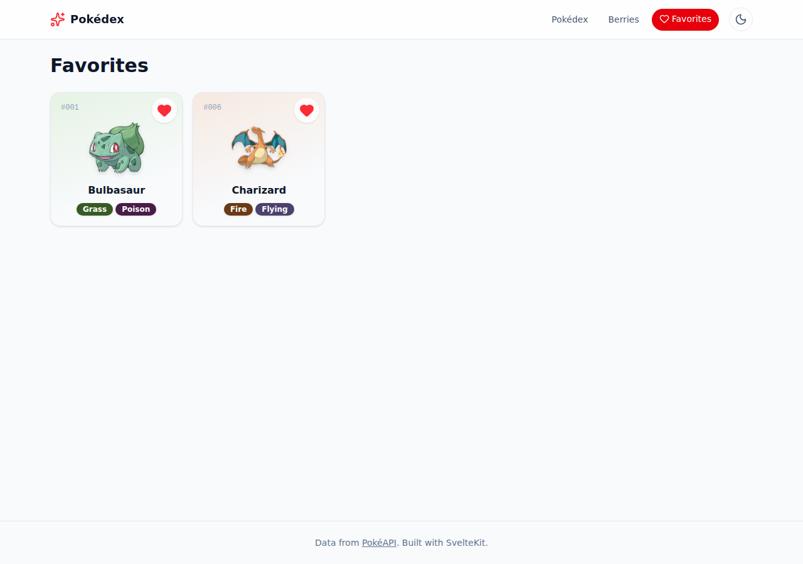

<div align="center">

# Pokédex

**A polished, animated Pokédex — search, filter, and explore every Pokémon and berry from PokéAPI.**

**[🔴 Live demo →](https://azagatti.github.io/pokedex-off-sm1/)**

[](https://github.com/AZagatti/pokedex-off-sm1/actions/workflows/ci.yml)     [](https://azagatti.github.io/pokedex-off-sm1/)

</div>

## Screenshots

| Pokédex | Detail |
| --- | --- |
|  |  |

| Dark mode | Berries |
| --- | --- |
|  |  |

| Berry detail | Favorites |
| --- | --- |
|  |  |

## Features

- **Pokédex list** — responsive card grid with infinite scroll (IntersectionObserver, 30/page), skeleton loaders, and type-colored gradients.
- **Search & filters** — debounced name search (250ms), filter by generation (1–9) and by type (multi-select, all 18 types), sort by dex number or base-stat total, with a one-click "clear filters" and an empty state.
- **Pokémon detail** — large official artwork with an entrance animation, animated base-stat bars, abilities (hidden ability tagged), example moves, a full evolution chain, a front/back/shiny sprite switcher, and a play-cry button.
- **Berries** — list and detail pages (firmness, flavors, growth time, size) with the same card aesthetic as the Pokédex.
- **Favorites** — heart any Pokémon from a card or its detail page; persisted to `localStorage` and survives reloads.
- **Global** — dark/light theme toggle (persisted, respects `prefers-color-scheme`), responsive header/nav, a themed 404 page, loading/error states everywhere, and full keyboard/focus/ARIA support.
- Every animation respects `prefers-reduced-motion`.

## Tech stack

| Layer | Choice |
| --- | --- |
| Framework | [SvelteKit](https://svelte.dev/docs/kit) (Svelte 5 runes) + TypeScript (strict) |
| Deployment | [`@sveltejs/adapter-static`](https://svelte.dev/docs/kit/adapter-static) → GitHub Pages (SPA fallback) |
| Styling | Tailwind CSS v4 + hand-written CSS for motion |
| Icons | [`lucide-svelte`](https://lucide.dev/) |
| Data | Native `fetch` in `load` functions + a small in-memory URL cache, validated with [Zod](https://zod.dev/) |
| State | Svelte 5 runes + `localStorage`-backed stores (theme, favorites) |
| Testing | [Vitest](https://vitest.dev/) (unit) + [Playwright](https://playwright.dev/) (e2e) |
| Lint/format | [Ultracite](https://ultracite.ai/) wiring [oxlint](https://oxc.rs/docs/guide/usage/linter) + [oxfmt](https://oxc.rs/) |
| Git hooks | [Lefthook](https://github.com/evilmartians/lefthook) (pre-commit: lint+format+typecheck, pre-push: full test suite) |
| CI/CD | GitHub Actions → GitHub Pages |

## Architecture

```
src/
├─ lib/
│  ├─ api/           # PokeAPI client: cache.ts (Map-based, URL-keyed), schemas.ts (zod), client.ts
│  ├─ components/     # PokemonCard, TypeBadge, StatBar, EvolutionChain, FilterToolbar, ...
│  ├─ stores/         # theme.svelte.ts, favorites.svelte.ts (runes + localStorage)
│  ├─ constants/      # type color palette, generations, stat labels
│  └─ pokedex/        # small pure helpers (stat totals, ...)
└─ routes/
   ├─ +page.svelte              # / — list, search, filters, infinite scroll
   ├─ pokemon/[name]/           # detail (client-rendered, prerender=false)
   ├─ berries/(+[name]/)        # berries list + detail
   ├─ favorites/                # localStorage-backed favorites grid
   └─ +error.svelte             # themed error / 404 page
```

See [`docs/ARCHITECTURE.md`](docs/ARCHITECTURE.md) for the full data-flow, caching, and routing writeup, and [`docs/DECISIONS.md`](docs/DECISIONS.md) for why each pinned tool was chosen and the tradeoffs made along the way.

## Run locally

```sh
npm install
npm run dev          # start the dev server

npm run check         # svelte-check + tsc
npm run lint          # ultracite (oxlint)
npm run format         # oxfmt
npm run test:unit      # vitest
npm run test:e2e       # playwright (builds + previews first)
npm run build          # static build → build/
```

Run `npx lefthook install` once after cloning to enable the pre-commit/pre-push git hooks.

## Deployment

Pushing to `main` runs the full pipeline (lint → typecheck → unit tests → build → e2e → build for Pages → deploy) via [`.github/workflows/ci.yml`](.github/workflows/ci.yml), then publishes to GitHub Pages with `actions/upload-pages-artifact` + `actions/deploy-pages`.

---

<sub>Data from [PokéAPI](https://pokeapi.co). Not affiliated with Nintendo, Game Freak, or The Pokémon Company.</sub>
